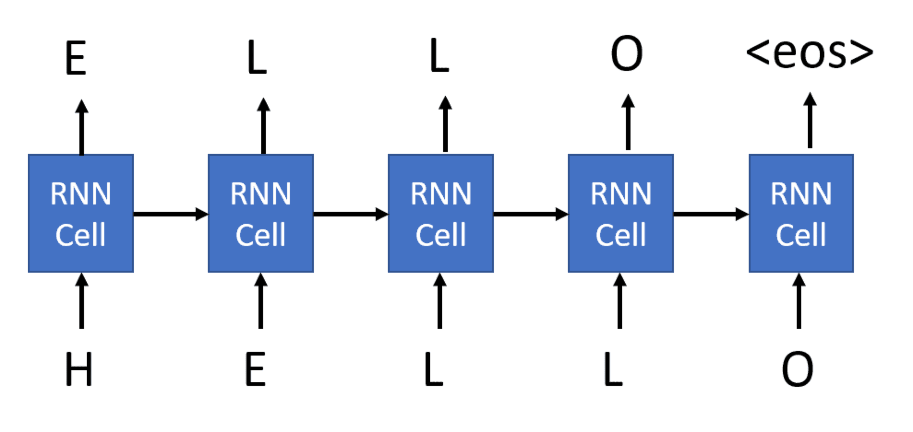

# Generative networks

Recurrent Neural Networks (RNNs) and their gated cell variants such as Long Short Term Memory Cells (LSTMs) and Gated Recurrent Units (GRUs) provided a mechanism for language modeling, i.e. they can learn word ordering and provide predictions for next word in a sequence. This allows us to use RNNs for **generative tasks**, such as ordinary text generation, machine translation, and even image captioning.

In RNN architecture we discussed in the previous unit, each RNN unit produced next next hidden state as an output. However, we can also add another output to each recurrent unit, which would allow us to output a **sequence** (which is equal in length to the original sequence). Moreover, we can use RNN units that do not accept an input at each step, and just take some initial state vector, and then produce a sequence of outputs.

This allows for different neural architectures that are shown in the picture below:


> Image from blog post [Unreasonable Effectiveness of Recurrent Neural Networks](http://karpathy.github.io/2015/05/21/rnn-effectiveness/) by [Andrej Karpaty](http://karpathy.github.io/)

* **One-to-one** is a traditional neural network with one input and one output
* **One-to-many** is a generative architecture that accepts one input value, and generates a sequence of output values. For example, if we want to train **image captioning** network that would produce a textual description of a picture, we can a picture as input, pass it through CNN to obtain hidden state, and then have recurrent chain generate caption word-by-word
* **Many-to-one** corresponds to RNN architectures we described in the previous unit, such as text classification
* **Many-to-many**, or **sequence-to-sequence** corresponds to tasks such as **machine translation**, where we have first RNN collect all information from the input sequence into the hidden state, and another RNN chain unrolls this state into the output sequence.

In this unit, we will focus on simple generative models that help us generate text. For simplicity, we will use character-level tokenization.

The way we will train RNN to generate text is the following. On each step, we will take a sequence of characters of length `nchars`, and ask the network to generate next output character for each input character:



When generating text (during inference), we start with some **prompt**, which is passed through RNN cells to generate intermediate state, and then from this state the generation starts. We generate one character at a time, and pass the state and the generated character to another RNN cell to generate the next one, until we generate enough characters.


> Image by author
## Continue to Notebooks

* [Generative Networks with PyTorch](GenerativePyTorch.ipynb)
* [Generative Networks with TensorFlow](GenerativeTF.ipynb)

## Soft text generation and temperature

Output of each RNN cell is a probability distribution of characters. If we always take the character with highest probability as the next character in generated text, the text often can become "cycled" between the same character sequences again and again, like in this example:

```
today of the second the company and a second the company ...
```

However, if we look at the probability distribution for the next character, it could be that the difference between a few highest probabilities is not huge, e.g. one character can have probability 0.2, another - 0.19, etc. For example, when looking for the next character in the sequence '*play*', next character can equally well be either space, or **e** (as in the word *player*).

This leads us to the conclusion that it is not always "fair" to select the character with higher probability, because choosing the second highest might still lead us to meaningful text. It is more wise to **sample** characters from the probability distribution given by the network output. We can also use a parameter, **temperature**, that will flatten out the probability distribution, in case we want to add more randomness, or make it more steep, if we want to stick more to the highest-probability characters.

Have a look at how this soft text generation is implemented in the notebooks.
